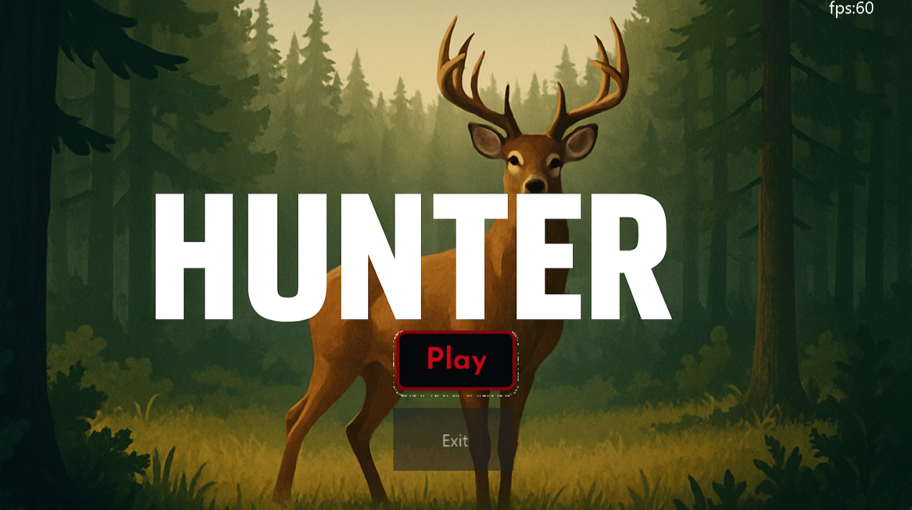
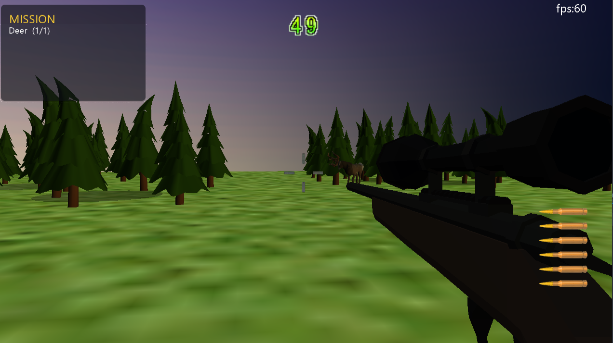

# MyGame-Hunter
DirectX 11、C++、DirectXツールキットを使用して構築されたFPSシューティングゲーム。
# HUNTER — First-Person Sniper Hunting Game / 一人称スナイパー狩猟ゲーム

A first-person sniper hunting game built in C++ with DirectX 11.
The player hunts wild animals across 3 stages, completing timed missions and facing a final boss.

C++ と DirectX 11 で制作した一人称スナイパー狩猟ゲームです。
全3ステージで野生動物を狩り、制限時間内にミッションを達成します。最終ステージにはボスが出現します。

> **Solo project / 個人制作** ・ Development period / 制作期間: 10 months (10か月)

---

## Screenshots / スクリーンショット

<!-- Add 2-4 screenshots here. Place image files in a /docs or /screenshots folder. -->
<!-- スクリーンショットをここに追加してください（/docs または /screenshots フォルダに配置）。 -->

| Title / タイトル | Gameplay / ゲームプレイ |
|---|---|
|  | 

---

## Highlights / アピールポイント

### Animal Patrol & Behavior System / 動物の巡回・行動システム

The main technical focus of this project.
本プロジェクトで最も力を入れた部分です。

- **Catmull-Rom spline movement** — animals follow smooth curved paths instead of straight lines between waypoints.
  ウェイポイント間を直線ではなく Catmull-Rom スプラインで補間し、自然な曲線移動を実現。
- **Data-driven design (JSON)** — patrol routes, spawn counts, and stage settings are defined in external JSON and parsed with PicoJSON, so stages can be tuned without recompiling.
  巡回経路・出現数・ステージ設定を外部 JSON に定義し、PicoJSON で読み込み。再コンパイルせずに調整可能。
- **Per-animal variation** — each animal gets a different route and speed, so the group feels alive.
  各個体に異なる経路と速度を割り当て、群れが生きているように見せる。
- **Reactive behavior** — a missed shot spooks nearby animals; they switch to a run animation and flee along their paths.
  射撃を外すと近くの動物が驚き、走るアニメーションに切り替わって逃走。
- **Animation state machine** — Walk / Idle / Run / Dead, synchronized with movement.
  歩行 / 待機 / 走行 / 死亡の状態を移動と同期して切り替え。

→ See / 参照: [`Objects/Deer.cpp`](Objects/Deer.cpp), [`Objects/Rabbit.cpp`](Objects/Rabbit.cpp), [`Stage/Levels.cpp`](Stage/Levels.cpp)

### Other Features / その他の機能

- **Bullet camera / バレットカメラ** — on key shots, the camera follows the bullet in slow motion to the impact.
  重要な射撃で、カメラが弾に追従しスローモーションで着弾までを見せる演出。
- **Thermal vision / サーマルビジョン** — an HLSL shader renders heat sources through the scope.
  HLSL シェーダーでスコープに熱源を表示。
- **Mission & score system / ミッション・スコアシステム** — timed missions, miss limits, scoring, and a result screen.
  制限時間・ミス回数制限・スコア計算・リザルト画面を実装。

→ See / 参照: [`Scene/TestScene.cpp`](Scene/TestScene.cpp), [`Objects/CameraManager.cpp`](Objects/CameraManager.cpp), [`Objects/Mission.cpp`](Objects/Mission.cpp)

---

## Tech Stack / 開発環境

| | |
|---|---|
| Language / 言語 | C++ |
| Graphics / 描画 | DirectX 11 |
| IDE | Visual Studio 2015 |
| Libraries / ライブラリ | DirectX Tool Kit (DXTK), ADX2 LE (audio), PicoJSON |

---

## Project Structure / プロジェクト構成

```
Objects/   — game entities (player, gun, animals, boss, bullet, camera)
             ゲーム内オブジェクト（プレイヤー・銃・動物・ボス・弾・カメラ）
Scene/     — game scenes (title, gameplay, result)
             シーン（タイトル・ゲームプレイ・リザルト）
Stage/     — stage and level data (JSON-driven)
             ステージ・レベルデータ（JSON駆動）
MyLib/     — utilities (raycasting, animation, math helpers)
             ユーティリティ（レイキャスト・アニメーション・数学補助）
```

---

## Notes / 注記

- **Assets not included / アセット非同梱**: 3D models, textures, and audio are excluded to keep the repository small. The code is the focus of this repository.
  3Dモデル・テクスチャ・音声はリポジトリ軽量化のため同梱していません。本リポジトリはコードの公開を目的としています。
- **Third-party libraries / 外部ライブラリ**: DirectX Tool Kit and ADX2 LE are not included; PicoJSON is included under its original BSD license.
  DirectX Tool Kit と ADX2 LE は同梱していません。PicoJSON は元の BSD ライセンスのもとで同梱しています。
